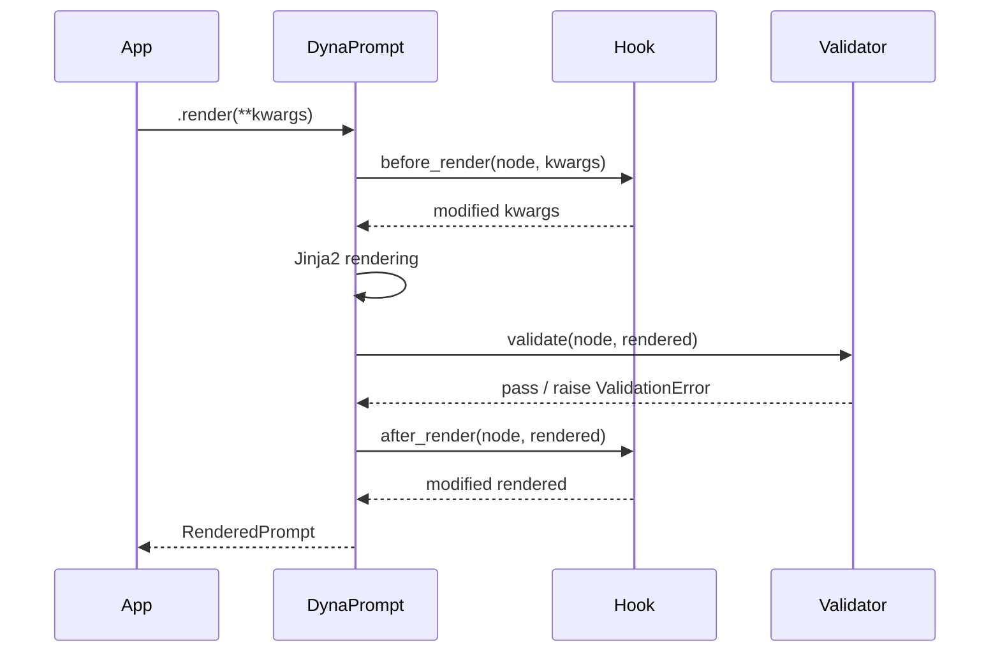

# Hooks & Validation

DynaPrompt provides two powerful mechanisms for controlling the rendering lifecycle: **Hooks** (intercept and modify) and **Validators** (enforce constraints).

---

## Lifecycle Overview



---

## Hooks

Hooks are plain Python functions (or async functions) that you attach to the `before_render` or `after_render` event.

### `before_render` — Inject Context

Use this to automatically inject data into every render call:

```python
from datetime import datetime
from dynaprompt import DynaPrompt

prompts = DynaPrompt(settings_files=["prompts/"])

def inject_date(node, kwargs):
    kwargs["current_date"] = datetime.now().strftime("%Y-%m-%d")
    return kwargs

prompts.add_hook("before_render", "inject_date", inject_date)

# current_date is now automatically available in every template
rendered = prompts.report.render(title="Q1 Summary")
```

### `after_render` — Observe Output

Use this to log, audit, or post-process every rendered prompt:

```python
import logging

def log_render(node, rendered):
    logging.info(
        "Rendered '%s' | hash=%s | env=%s",
        node.name, rendered.prompt_hash, rendered.current_env
    )
    return rendered

prompts.add_hook("after_render", "log_render", log_render)
```

### Async Hooks

Any hook can be an `async` function and will be awaited automatically when using `async_render()`:

```python
async def async_redact_pii(node, kwargs):
    kwargs["user_text"] = await pii_service.redact(kwargs["user_text"])
    return kwargs

prompts.add_hook("before_render", "redact_pii", async_redact_pii)
```

---

## Validation

Validators run **after** rendering and can raise `ValidationError` to block the output.

### Built-in `PromptValidator`

The standard validator covers the most common cases declaratively:

```python
from dynaprompt import DynaPrompt
from dynaprompt.validator import PromptValidator

validator = PromptValidator(
    "customer_service",       # Prompt name(s) this applies to
    requires=["user", "issue"], # Required render variables
    max_tokens=4096,            # Heuristic token limit guard
    env="production",           # Only enforce in production
)

prompts = DynaPrompt(
    settings_files=["prompts/"],
    validators=[validator]
)
```

### Custom Validators

For full control (e.g., using a real tokenizer like `tiktoken`):

```python
import tiktoken
from dynaprompt.validator import PromptValidator, ValidationError

class TiktokenValidator(PromptValidator):
    def __init__(self, max_tokens: int, model: str = "gpt-4o"):
        self.max_tokens = max_tokens
        self.enc = tiktoken.encoding_for_model(model)

    def validate(self, node, rendered) -> None:
        token_count = len(self.enc.encode(rendered.text))
        if token_count > self.max_tokens:
            raise ValidationError(
                f"Prompt '{node.name}' has {token_count} tokens "
                f"(limit: {self.max_tokens})"
            )

prompts = DynaPrompt(
    settings_files=["prompts/"],
    validators=[TiktokenValidator(max_tokens=8192)]
)
```

### Combining Validators

Use `&` (AND) and `|` (OR) operators to compose complex rules:

```python
from dynaprompt.validator import PromptValidator

v1 = PromptValidator("chat", requires=["user_message"])
v2 = PromptValidator("chat", max_tokens=2048)

# Both must pass
combined = v1 & v2

prompts = DynaPrompt(settings_files=["prompts/"], validators=[combined])
```

---

!!! warning "Validation runs on every `.render()` call"
    Validators are not cached. Keep custom validators lightweight or use async hooks for heavy I/O (like calling an external moderation API).
