# DynaPrompt

**Prompt management that grows with your LLM application.**

DynaPrompt brings the configuration philosophy of [Dynaconf](https://www.dynaconf.com) to the world of LLM prompt engineering — zero I/O at import time, environment-aware layering, and Jinja2-powered templates.

---

## Why DynaPrompt?

=== "The Old Way"

    ```python
    # Prompts are scattered — mixed into application logic
    def analyze_call(transcript: str) -> str:
        prompt = f"""You are an expert call analyzer.
    Analyze the following call transcript and extract:
    - Key issues raised
    - Customer sentiment (1-5)
    - Agent performance

    Transcript:
    {transcript}

    Respond in JSON."""
        return call_llm(prompt, model="gpt-4o", temperature=0.1)
    ```

    - :x: Hard to update prompts without touching code
    - :x: No environment-specific overrides (dev vs. prod model)
    - :x: No validation or token limit guards
    - :x: No version tracking or audit logs

=== "The DynaPrompt Way"

    ```markdown title="prompts/analyze_call.md"
    ---
    model: gpt-4o
    temperature: 0.1
    ---
    You are an expert call analyzer.
    Analyze the following call transcript and extract:
    - Key issues raised
    - Customer sentiment (1-5)
    - Agent performance

    Transcript: {{ transcript }}

    Respond in JSON.
    ```

    ```python title="app.py"
    from dynaprompt import DynaPrompt

    prompts = DynaPrompt(settings_files=["prompts/"])
    result = prompts.analyze_call.render(transcript=transcript)
    ```

    - :white_check_mark: Prompts are versioned and reviewable like code
    - :white_check_mark: Switch models per environment (dev → gpt-3.5, prod → gpt-4o)
    - :white_check_mark: Token limit validation built-in
    - :white_check_mark: Every render produces a SHA-256 hash for audit trails

---

## Installation

=== "uv (Recommended)"

    ```bash
    uv add dynaprompt
    ```

=== "pip"

    ```bash
    pip install dynaprompt
    ```

---

## 5-Minute Quick Start

### Step 1: Create a Prompt File

```markdown title="prompts/greeting.md"
---
model: gpt-4o
temperature: 0.7
max_tokens: 512
---
You are a helpful assistant for {{ app_name }}.

Greet the user named {{ user_name }} warmly and ask how you can help them today.
```

### Step 2: Load and Render

```python
from dynaprompt import DynaPrompt

prompts = DynaPrompt(settings_files=["prompts/"])

rendered = prompts.greeting.render(
    user_name="Ahmed",
    app_name="TechTrax"
)

print(rendered.text)         # The final prompt string
print(rendered.config)       # {'model': 'gpt-4o', 'temperature': 0.7, ...}
print(rendered.prompt_hash)  # SHA-256 for audit logging
```

### Step 3: Inspect What's Loaded

```python
# See all available prompts
print(prompts.keys())  # ['greeting', 'support.chat', ...]

# Rich debug info
prompts.inspect()
```

---

## Core Concepts

```mermaid
graph LR
    A[📁 Prompt Files<br/>.md / .toml / .py] --> B[DynaPrompt]
    C[🌍 Environment<br/>dev / staging / prod] --> B
    D[📦 Variables<br/>.json / .yaml / dicts] --> B
    B --> E[PromptNode]
    E --> F[🎨 .render&#40;**kwargs&#41;]
    F --> G[RenderedPrompt<br/>text + config + hash]
```



| Concept | Description |
|---|---|
| `DynaPrompt` | The central manager — lazy-loads and caches everything |
| `PromptNode` | A single prompt template with its configuration |
| `RenderedPrompt` | The output of `.render()` — text, config, and a SHA-256 hash |
| Environment | A named context (`development`, `production`) that controls which values win |

---

## What's Next?

<div class="grid cards" markdown>

- :material-clock-fast: **[Getting Started](dynaprompt.md)** — Full guide to formats, directories, and variables
- :material-layers: **[Environment Layering](advanced/environments.md)** — Override prompts per environment
- :material-hook: **[Hooks & Validation](advanced/hooks.md)** — Intercept renders and enforce constraints
- :material-lightning-bolt: **[Async Support](advanced/async.md)** — Use DynaPrompt in FastAPI & async agents

</div>
